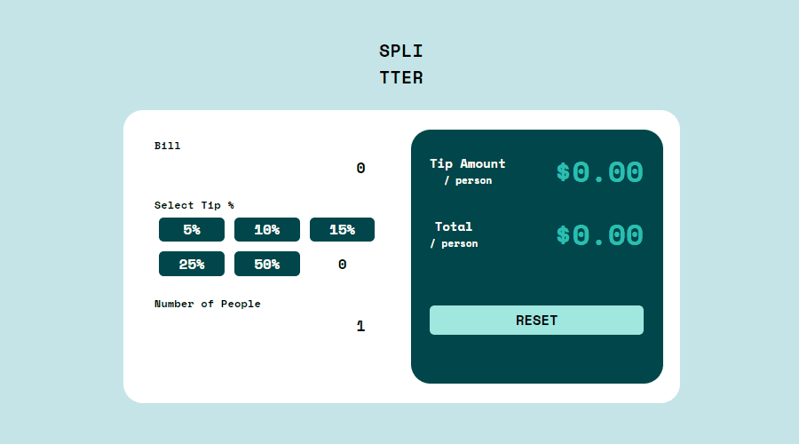

# Desafio Tip Calculator do site frontendmentor.io


## Descrição:
Página responsiva para diversas telas. Finalidade do site calcular o total pago por individuo e o total de gorjeta pago individualmente para o caso de ser uma pessoa ou mais\
<a href="https://femtipcalculator.netlify.app/">Link do site, veja o responsivo</a>


## Indice
- <a href="#aprendizagens">Aprendizagens</a>
- <a href="#funcionalidades"> Funcionalidades </a>
- <a href="#tecnologias"> Tecnologias </a>
- <a href="#rodar"> Rodar </a>
- <a href="#colaboradores"> Colaboradores </a>
- <a href="#next"> Next </a>
- <a href="#contato"> Contatos </a>

## Aprendizagens
- [x] Utilização do redux com acesso aos ultimos estados evoluidos.
- [x] Muita componentização individual tendo que compartilhar estaodos e funções de modificações neles.
- [x] Desenvolvido todo com flex box.
- [x] Tipagem por inferência com algumas execeções como o store do redux.

## Funcionalidades
- [x] Inserção do total pago não incluindo gorjeta
- [x] Escolha da quantia de gorjeta por componentes pré-definidos e um componente personalizado.
- [x] Escolha da quantidade de pessoas a dividir o montante e gorjeta.
- [x] Exibição da gorjeta paga individual.
- [x] Exibição do total pago individual.
- [x] Botão reset para zerar todos os estados.


## Tecnologias
1. [React](https://pt-br.reactjs.org)
2. [Flexbox CSS](https://developer.mozilla.org/pt-BR/docs/Web/CSS/CSS_Flexible_Box_Layout/Basic_Concepts_of_Flexbox/)
3. [Typescript](https://www.typescriptlang.org/docs/)
4. [Redux](https://https://redux.js.org/)

## Rodar
```bash
# Projeto inicializado com Create React App
# https://github.com/facebook/create-react-app

# Clone o repositório na pasta desejada
$ git clone https://github.com/vitorhub/tip-calculator-app-main-react-ts.git

# Acesse a pasta do projeto no seu terminal
$ cd tip-calculator-app-main-react-ts/

# Instale as dependencias
$ npm install

# Inicialize o projeto no navegador
$ npm start

# Para criar o arquivo de produção
$ npm run build

# A aplicação será acessada na porta 3000,
acesse pelo navegador: http://localhost:3000
```

## Colaboradores
Vitor Falcao\


## Next
- [ ] Aprimorar algumas tipagens definidas como any provisoriamente.

## Contato
<a href="https://www.linkedin.com/in/vitorfalcaodesenvolvedor/"> Linkedin </a>
